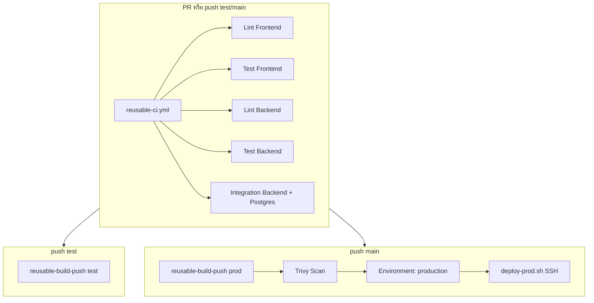

# CI/CD Guide — Basic App

เอกสารนี้อธิบาย pipeline CI/CD ปัจจุบันของโปรเจกต์ (Phase 1–4) และขั้นตอนตั้งค่า GitHub ที่ต้องทำด้วยมือ

---

## Pipeline Overview



---

## Workflows

| ไฟล์ | Trigger | หน้าที่ |
|---|---|---|
| [`.github/workflows/ci.yml`](.github/workflows/ci.yml) | PR + push → `main`, `test` | Quality gate เท่านั้น |
| [`.github/workflows/ci-cd-test.yml`](.github/workflows/ci-cd-test.yml) | push/PR → `test` | CI → build image (push เฉพาะ push event) |
| [`.github/workflows/ci-cd-main.yml`](.github/workflows/ci-cd-main.yml) | push → `main` | CI → build → Trivy → deploy (smoke + auto-rollback) |
| [`.github/workflows/codeql.yml`](.github/workflows/codeql.yml) | PR/push + schedule | SAST (C# + TypeScript) |
| [`.github/dependabot.yml`](.github/dependabot.yml) | weekly | อัปเดต npm, NuGet, Actions |

### Reusable workflows

- [`reusable-ci.yml`](.github/workflows/reusable-ci.yml) — lint, unit test, integration test
- [`reusable-build-push.yml`](.github/workflows/reusable-build-push.yml) — build/push Docker images ไป GHCR

---

## Branch Protection (ตั้งด้วยมือบน GitHub)

ไปที่ **Settings → Rules → Rulesets** (หรือ Branch protection rules)

### สำหรับ `main`

- ห้าม push ตรง (Require pull request)
- ต้องมี approval อย่างน้อย 1 คน
- Block force push
- **Require status checks to pass** — เลือก checks เหล่านี้จาก workflow `CI`:
  - `Lint Frontend`
  - `Test Frontend`
  - `Lint Backend`
  - `Test Backend`
  - `Integration Backend`
- Require branches to be up to date before merging

### สำหรับ `test`

- Require pull request
- Require status checks (ชุดเดียวกับ `CI` ด้านบน)

> ชื่อ check อาจแสดงเป็น `CI / Lint Frontend` ขึ้นกับชื่อ workflow ใน GitHub Actions UI

---

## GitHub Environment (Production)

ไปที่ **Settings → Environments → New environment** ชื่อ `production`

- เปิด **Required reviewers** (อย่างน้อย 1 คน)
- จำกัด deployment branch เป็น `main` เท่านั้น
- (Optional) ตั้ง **Environment variable** `PROD_URL` เป็น URL production สำหรับแสดงใน deployment log

### Secrets ที่ต้องมี

| Secret | ใช้ทำอะไร |
|---|---|
| `PROD_HOST` | IP/hostname ของ VM |
| `PROD_USER` | SSH user |
| `PROD_SSH_KEY` | Private key สำหรับ SSH |
| `GHCR_USERNAME` | Username สำหรับ `docker login` บน VM |
| `GHCR_TOKEN` | PAT สำหรับ pull images จาก GHCR |

---

## Production Deploy Flow

1. Merge PR เข้า `main`
2. `ci-cd-main.yml` รัน CI ทั้งหมด
3. Build + push images tag `prod` และ `sha-<short>` ไป GHCR
4. Trivy scan images (CRITICAL/HIGH, `ignore-unfixed: true`)
5. รอ approval ใน Environment `production`
6. SCP [`scripts/`](scripts/) (`deploy-prod.sh`, `rollback-prod.sh`, `smoke-test.sh`) ไป VM แล้วรัน deploy:
   - อ่าน rollback target จาก `~/basic_app/.last-good-deploy` (ถ้ามี)
   - pull images tag `:prod`
   - `up -d --no-deps --wait api` ก่อน
   - `up -d --no-deps --wait frontend` ทีหลัง
   - smoke test (`smoke-test.sh`): retry 5 ครั้ง, sleep 5 วินาที, ตรวจ HTTP 200 ที่ `127.0.0.1:5001/health` และ `127.0.0.1:4200/`
   - ถ้า smoke ผ่าน: บันทึก `sha-<commit>` ลง `.last-good-deploy` แล้ว `docker image prune`
   - ถ้า smoke fail: รัน `rollback-prod.sh` อัตโนมัติ (workflow ยัง fail แม้ rollback สำเร็จ)

[`docker-compose.prod.yml`](docker-compose.prod.yml) มี `healthcheck` บน `api` และ `frontend` รอ `api` healthy ก่อน start

---

## Auto Rollback

State file บน VM: `~/basic_app/.last-good-deploy`

เก็บ image tag `sha-<commit>` ล่าสุดที่ deploy + smoke สำเร็จ:

```
BACKEND_IMAGE=ghcr.io/wiratatwork/basic-app-backend:sha-abc1234
FRONTEND_IMAGE=ghcr.io/wiratatwork/basic-app-frontend:sha-abc1234
DEPLOY_SHA=abc1234
DEPLOYED_AT=2026-06-25T12:00:00Z
```

| สถานการณ์ | พฤติกรรม |
|-----------|----------|
| Deploy ครั้งแรก (ไม่มี state file) | smoke fail → exit 1, ไม่ rollback |
| Deploy ใหม่ fail, มี state | `rollback-prod.sh` อัตโนมัติ → workflow **fail** (แดง) แม้ production กลับมาใช้งานได้ |
| Rollback ก็ fail | exit 1 — ต้องแก้บน VM ด้วยมือ |

### Manual rollback (ฉุกเฉิน)

```bash
cd ~/basic_app

export BACKEND_IMAGE=ghcr.io/wiratatwork/basic-app-backend:sha-abc1234
export FRONTEND_IMAGE=ghcr.io/wiratatwork/basic-app-frontend:sha-abc1234

docker compose -f docker-compose.prod.yml pull api frontend
docker compose -f docker-compose.prod.yml up -d --no-deps --wait api
docker compose -f docker-compose.prod.yml up -d --no-deps --wait frontend
./scripts/smoke-test.sh
```

---

## รัน Tests ในเครื่อง

```bash
# Frontend
cd frontend
npm ci
npm run lint
npm test -- --watch=false

# Backend unit tests
dotnet test --filter "FullyQualifiedName!~Integration"

# Backend integration tests (ต้องมี Postgres ที่ localhost:5432)
$env:TEST_DB_CONNECTION="Host=localhost;Port=5432;Database=demo;Username=sa;Password=test"
dotnet test --filter "FullyQualifiedName~Integration"
```

---

## Q&A เดิม (อ้างอิงด่วน)

เปลี่ยน image ใน docker-compose.test.yml → ใช้ Image จาก GHCR tag `test`

ทำไม test/prod compose ไม่มี postgres → override จาก docker-compose.yml base (หรือใช้ RDS)

GHCR → GitHub Container Registry เก็บ Docker images

Ruleset ที่นิยม → Restrict direct push, require PR, require status checks, block force push

SSH deploy → ครั้งแรก setup VM + `.env` หลังจากนั้น CI pull images อัตโนมัติ

docker image prune -f → ลบ images ที่ไม่ใช้ ประหยัด disk

Deploy กระทบ user → downtime สั้น (rolling deploy ลดผลกระทบ แต่ยังไม่ใช่ zero-downtime เต็มรูปแบบ)

ดู images บน GHCR → GitHub Profile → Packages
