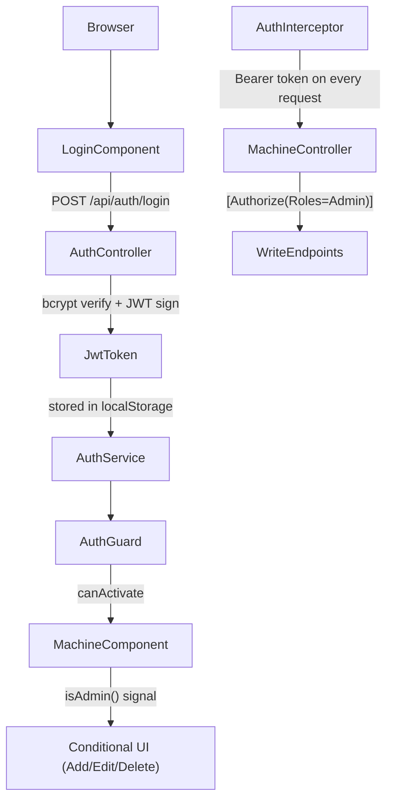

# Auth System — Production Grade Implementation

## Architecture Overview



## Backend Changes

### 1. [`backend/backend.csproj`](backend/backend.csproj)
Add two NuGet packages:
- `Microsoft.AspNetCore.Authentication.JwtBearer` (v10.x)
- `BCrypt.Net-Next` (v4.x)

### 2. [`backend/appsettings.json`](backend/appsettings.json)
Add JWT config section:
```json
"Jwt": {
  "Key": "YOUR-256-BIT-SECRET-KEY-HERE-MUST-BE-LONG",
  "Issuer": "BasicApp",
  "Audience": "BasicApp",
  "ExpiryMinutes": 480
}
```

### 3. [`backend/Models/User.cs`](backend/Models/User.cs) — NEW
```csharp
public class User {
    public int Id { get; set; }
    public string Username { get; set; }
    public string PasswordHash { get; set; }
    public string Role { get; set; }  // "Admin" | "User"
}
```

### 4. [`backend/Models/AuthModels.cs`](backend/Models/AuthModels.cs) — NEW
DTOs: `LoginRequest`, `LoginResponse`, `UserDto`

### 5. [`backend/Data/AppDbContext.cs`](backend/Data/AppDbContext.cs) — UPDATE
- Add `DbSet<User> Users`
- Seed 2 default users on `OnModelCreating`:
  - `admin` / `Admin@1234` → Role: Admin
  - `user` / `User@1234` → Role: User

### 6. [`backend/Controllers/AuthController.cs`](backend/Controllers/AuthController.cs) — NEW
`POST /api/auth/login` — verify credentials with BCrypt, return signed JWT with `name` + `role` claims

### 7. [`backend/Controllers/MachineController.cs`](backend/Controllers/MachineController.cs) — UPDATE
- `[Authorize]` on class level (all endpoints require auth)
- `[Authorize(Roles = "Admin")]` on POST, PATCH, DELETE endpoints
- Read endpoints (`GET`, `search`, `checkDuplicateName`) allow any authenticated role

### 8. [`backend/Program.cs`](backend/Program.cs) — UPDATE
- Register `AddAuthentication(JwtBearer)` with token validation
- Add `app.UseAuthentication()` and `app.UseAuthorization()` (before `MapControllers`)
- Restrict CORS to specific frontend origin (not `AllowAnyOrigin`)
- Add Swagger JWT Bearer security definition

### 9. New EF Migration
`AddUsersTable` — creates `users` table, seeds default users

---

## Frontend Changes

### 10. [`frontend/src/app/auth/auth.model.ts`](frontend/src/app/auth/auth.model.ts) — NEW
```typescript
export interface LoginRequest { username: string; password: string; }
export interface LoginResponse { token: string; username: string; role: string; }
export type UserRole = 'Admin' | 'User';
```

### 11. [`frontend/src/app/auth/auth.service.ts`](frontend/src/app/auth/auth.service.ts) — NEW
- `login()` → POST to `/api/auth/login`, store JWT in `localStorage`
- `logout()` → clear storage, navigate to `/login`
- `currentUser` signal (username + role)
- `isAdmin()` computed signal
- `isLoggedIn()` computed signal
- Restore session from `localStorage` on init

### 12. [`frontend/src/app/auth/auth.guard.ts`](frontend/src/app/auth/auth.guard.ts) — NEW
`canActivate` functional guard — redirects to `/login` if not authenticated

### 13. [`frontend/src/app/auth/auth.interceptor.ts`](frontend/src/app/auth/auth.interceptor.ts) — NEW
HTTP interceptor — attaches `Authorization: Bearer <token>` to every outgoing request. On 401 response → auto-logout.

### 14. [`frontend/src/app/auth/login/login.component.*`](frontend/src/app/auth/login/) — NEW (ts + html + css)
- Reactive form: `username`, `password` fields
- Error message on failed login
- Styled consistently with existing machine component design

### 15. [`frontend/src/app/app.routes.ts`](frontend/src/app/app.routes.ts) — UPDATE
```typescript
export const routes: Routes = [
  { path: 'login', component: LoginComponent },
  { path: '', component: MachineComponent, canActivate: [authGuard] },
  { path: '**', redirectTo: '' },
];
```

### 16. [`frontend/src/app/app.config.ts`](frontend/src/app/app.config.ts) — UPDATE
Register `withInterceptors([authInterceptor])` in `provideHttpClient()`

### 17. [`frontend/src/app/machine/machine.component.ts`](frontend/src/app/machine/machine.component.ts) — UPDATE
- Inject `AuthService`
- Expose `isAdmin = this.authService.isAdmin` computed signal for template

### 18. [`frontend/src/app/machine/machine.component.html`](frontend/src/app/machine/machine.component.html) — UPDATE
- Wrap "เพิ่มเครื่องจักร" button with `@if (isAdmin())`
- Wrap "แก้ไข" and "ลบ" buttons with `@if (isAdmin())`
- Hide "จัดการ" column header when not admin
- Add top navbar with username display + logout button

### 19. [`frontend/src/app/app.html`](frontend/src/app/app.html) — stays as `<router-outlet />`
Navbar will be inside `MachineComponent` header to keep layout self-contained.

---

## Default Credentials (Seeded)

| Role | Username | Password |
|------|----------|----------|
| Admin | `admin` | `Admin@1234` |
| User | `user` | `User@1234` |

---

## File Count Summary
- **Backend**: 5 new files, 4 modified, 1 new migration
- **Frontend**: 5 new files (auth folder), 4 modified files
