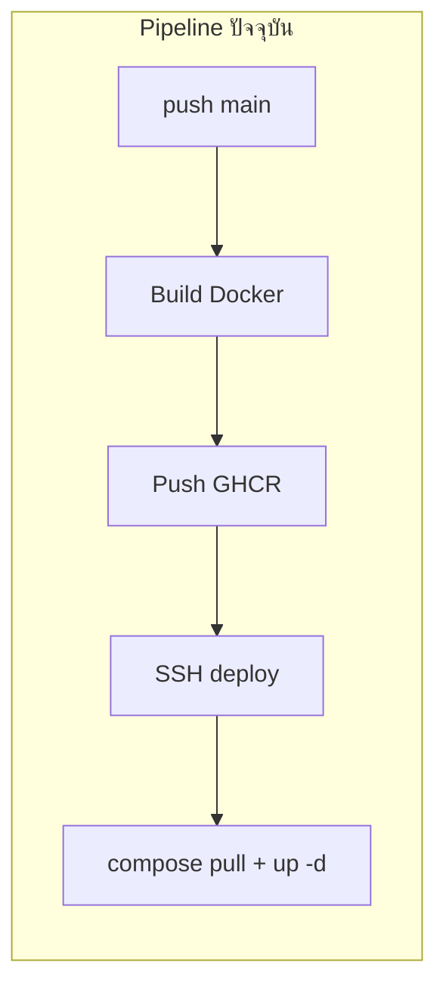
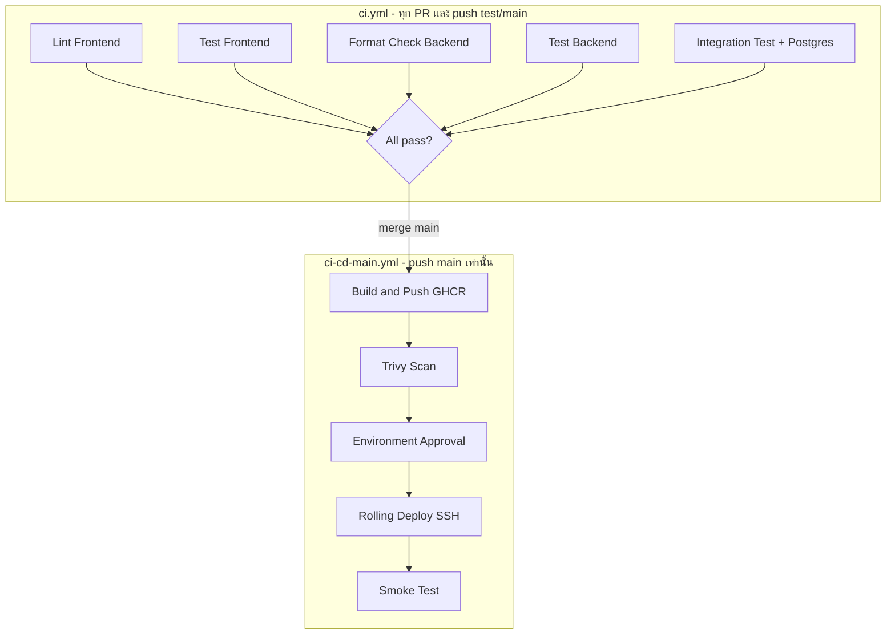

# แผน CI/CD Phase 1-4 สำหรับ Basic App

## สถานะปัจจุบัน (Gap Analysis)



| มีแล้ว | ยังไม่มี |
|---|---|
| GHCR + Buildx + GHA cache ([ci-cd-main.yml](.github/workflows/ci-cd-main.yml)) | Unit test / lint ใน CI |
| PR build บน `test` (ไม่ push) ([ci-cd-test.yml](.github/workflows/ci-cd-test.yml)) | PR trigger บน `main` |
| SSH deploy prod | Security scan (Trivy, Dependabot) |
| `/health` endpoint ([Program.cs](backend/Program.cs) L106) | Smoke test หลัง deploy |
| Frontend specs 3 ไฟล์ (Vitest) | Backend test project |
| | GitHub Environment approval |
| | `api` healthcheck ใน [docker-compose.prod.yml](docker-compose.prod.yml) |

**Stack อ้างอิง:** Angular 22 + Vitest, ASP.NET Core 10 + EF Core + Npgsql, PostgreSQL 16, Docker Compose, GHCR, VM SSH

---

## เป้าหมายหลัง Phase 1-4



---

## Phase 1: CI Foundation (Quality Gate)

### 1.1 สร้าง workflow ใหม่ `ci.yml`

ไฟล์: [`.github/workflows/ci.yml`](.github/workflows/ci.yml)

**Trigger:**
```yaml
on:
  pull_request:
    branches: [main, test]
  push:
    branches: [main, test]
```

**Jobs (รันขนาน):**

| Job | Stack | คำสั่ง |
|---|---|---|
| `lint-frontend` | Angular | `npm install` + `npx prettier --check .` |
| `test-frontend` | Vitest | `npm test -- --run` |
| `lint-backend` | .NET | `dotnet format --verify-no-changes` |
| `test-backend` | xUnit | `dotnet test` |

**Prerequisites ใน repo:**

1. **สร้าง `package-lock.json`** — ตอนนี้ไม่มี lock file ใน `frontend/` ต้อง generate แล้ว commit เพื่อใช้ `npm ci` ใน CI (เร็วและ reproducible)
2. **เพิ่ม script ใน** [frontend/package.json](frontend/package.json):
   ```json
   "lint": "prettier --check ."
   ```
3. **สร้าง test project** `backend.Tests/`:
   - `backend.Tests.csproj` อ้างอิง [backend/backend.csproj](backend/backend.csproj)
   - Packages: `Microsoft.NET.Test.Sdk`, `xunit`, `xunit.runner.visualstudio`, `Microsoft.AspNetCore.Mvc.Testing`
   - เริ่มจาก smoke test: `WebApplicationFactory` เรียก `GET /health` คืน 200
4. **เพิ่ม solution file** `BasicApp.sln` (optional แต่ช่วย `dotnet test` ที่ root)

### 1.2 ผูก Branch Protection (GitHub Settings — manual)

ตามที่ [HANDBOOK_DEPLOYMENT.md](HANDBOOK_DEPLOYMENT.md) และ [NOTE_CICD.md](NOTE_CICD.md) ระบุไว้แล้ว:

- `main`: ห้าม push ตรง, ต้อง PR, ต้อง approval, **Require status checks: `ci` jobs ทั้งหมด**
- `test`: ต้อง PR, ต้อง CI ผ่าน

---

## Phase 2: Workflow Architecture + Integration Test

### 2.1 แยก CI กับ CD ชัดเจน

| ไฟล์ | หน้าที่ | Trigger |
|---|---|---|
| `ci.yml` | Quality gate เท่านั้น | PR + push `test`/`main` |
| `ci-cd-test.yml` | Build + push GHCR `test` tag | push `test` (หลัง CI ผ่าน) |
| `ci-cd-main.yml` | Build + push + deploy prod | push `main` (หลัง CI ผ่าน) |

**วิธีบังคับ CI ก่อน CD (เลือกแนวทาง reusable workflow):**

สร้าง [`.github/workflows/reusable-ci.yml`](.github/workflows/reusable-ci.yml) รวม jobs จาก Phase 1 แล้วให้:
- `ci.yml` เรียก reusable (สำหรับ PR feedback)
- `ci-cd-main.yml` job แรกเรียก reusable ด้วย `needs` ก่อน `build-and-push`

```yaml
jobs:
  ci:
    uses: ./.github/workflows/reusable-ci.yml
  build-and-push:
    needs: ci
    ...
```

### 2.2 Integration test กับ PostgreSQL service container

เพิ่ม job `integration-backend` ใน reusable CI:

```yaml
services:
  postgres:
    image: postgres:16-alpine
    env:
      POSTGRES_USER: sa
      POSTGRES_PASSWORD: test
      POSTGRES_DB: demo
    ports: ['5432:5432']
    options: --health-cmd "pg_isready -U sa -d demo" ...
```

- ตั้ง env `ConnectionStrings__DefaultConnection` ชี้ `localhost:5432`
- รัน `WebApplicationFactory` ทดสอบ flow สำคัญ เช่น `POST /api/auth/login` (ใช้ seed user จาก [DbSeeder.cs](backend/Data/DbSeeder.cs))
- เรียนรู้ pattern **Testcontainers / service container** ที่นิยมใน .NET CI

### 2.3 ลด duplicate ระหว่าง test/main workflows

สร้าง [`.github/workflows/reusable-build-push.yml`](.github/workflows/reusable-build-push.yml):

**Inputs:** `image_tag`, `push` (bool), `environment` (test/prod)

ทั้ง [ci-cd-test.yml](.github/workflows/ci-cd-test.yml) และ [ci-cd-main.yml](.github/workflows/ci-cd-main.yml) เรียก reusable แทน copy-paste build steps

### 2.4 Path filters (optional แต่นิยม)

```yaml
paths:
  - 'backend/**'
  - 'frontend/**'
  - '.github/workflows/**'
```

แก้ docs อย่างเดียว → ไม่ trigger build

---

## Phase 3: Security & Supply Chain

### 3.1 Dependabot

ไฟล์: [`.github/dependabot.yml`](.github/dependabot.yml)

```yaml
version: 2
updates:
  - package-ecosystem: npm
    directory: /frontend
    schedule: { interval: weekly }
  - package-ecosystem: nuget
    directory: /backend
    schedule: { interval: weekly }
  - package-ecosystem: github-actions
    directory: /
    schedule: { interval: weekly }
```

### 3.2 Container image scanning (Trivy)

เพิ่ม job ใน CD workflows หลัง build (ก่อน deploy):

```yaml
- uses: aquasecurity/trivy-action@master
  with:
    image-ref: ghcr.io/${{ owner }}/basic-app-backend:sha-${{ github.sha }}
    severity: CRITICAL,HIGH
    exit-code: 1
```

สแกนทั้ง `basic-app-backend` และ `basic-app-frontend`

### 3.3 CodeQL (Static Analysis)

ไฟล์: [`.github/workflows/codeql.yml`](.github/workflows/codeql.yml)

- Languages: `csharp`, `javascript-typescript`
- Trigger: PR + push `main`/`test`
- เรียนรู้ **SAST** ที่ GitHub แนะนำสำหรับ open source / private repo

### 3.4 Secret hygiene

- ตรวจว่า [`.gitignore`](.gitignore) ครอบคลุม `.env`, `GitHub Token.txt`
- ไม่ log secrets ใน deploy script (ปัจจุบัน `docker login -p` ใน SSH script — พิจารณา `--password-stdin` แทน)

---

## Phase 4: Safe Production Deploy

### 4.1 GitHub Environment + Manual Approval

แก้ `deploy-prod` ใน [ci-cd-main.yml](.github/workflows/ci-cd-main.yml):

```yaml
deploy-prod:
  needs: [build-and-push, trivy-scan]
  environment:
    name: production
    url: https://your-domain.com
```

ตั้งใน GitHub → Settings → Environments → `production`:
- Required reviewers (1 คน)
- Deployment branches: `main` only

### 4.2 ปรับ `docker-compose.prod.yml`

เพิ่ม healthcheck ให้ `api` (copy จาก [docker-compose.yml](docker-compose.yml) L46-51):

```yaml
healthcheck:
  test: ["CMD-SHELL", "curl -f http://localhost:5001/health || exit 1"]
  interval: 15s
  timeout: 10s
  retries: 5
  start_period: 30s
```

เปลี่ยน `frontend.depends_on`:
```yaml
depends_on:
  api:
    condition: service_healthy
```

### 4.3 Rolling deploy script (ลด downtime)

สร้าง [`scripts/deploy-prod.sh`](scripts/deploy-prod.sh) บน VM (หรือ inline ใน SSH action):

```bash
# 1. pull images
docker compose -f docker-compose.prod.yml pull api frontend

# 2. update API ก่อน รอ healthy
docker compose -f docker-compose.prod.yml up -d --no-deps --wait api

# 3. update frontend ทีหลัง
docker compose -f docker-compose.prod.yml up -d --no-deps --wait frontend

# 4. cleanup
docker image prune -f
```

`--no-deps` = ไม่ restart postgres, `--wait` = รอ healthcheck ผ่าน

### 4.4 Smoke test หลัง deploy

เพิ่ม job `smoke-test` หลัง SSH deploy:

```yaml
- name: Smoke test API
  run: curl -fsS https://your-domain.com/api/...  # หรือ curl ผ่าน PROD_HOST
- name: Smoke test Frontend
  run: curl -fsS https://your-domain.com/
```

หรือรัน smoke จากภายใน VM ผ่าน SSH:
```bash
curl -fsS http://127.0.0.1:5001/health
curl -fsS http://127.0.0.1:4200/
```

ถ้า fail → workflow fail → แจ้งทีม rollback ด้วย image tag `sha-<short>` ที่มีอยู่แล้วใน GHCR

### 4.5 Concurrency control

```yaml
concurrency:
  group: deploy-production
  cancel-in-progress: false
```

ป้องกัน deploy ซ้อนกันบน prod

### 4.6 อัปเดตเอกสาร

ขยาย [NOTE_CICD.md](NOTE_CICD.md) หรือสร้าง `docs/CICD.md` อธิบาย:
- Flow ใหม่ (CI → Build → Scan → Approve → Deploy → Smoke)
- วิธี rollback: `docker compose` + image tag `sha-xxx`
- Branch protection checklist

---

## โครงสร้างไฟล์ที่จะเพิ่ม/แก้

```
.github/
  workflows/
    ci.yml                    # NEW - entry CI สำหรับ PR
    reusable-ci.yml           # NEW - lint + test + integration
    reusable-build-push.yml   # NEW - DRY build/push
    ci-cd-main.yml            # MODIFY - needs ci, trivy, env, smoke
    ci-cd-test.yml            # MODIFY - needs ci, reusable build
    codeql.yml                # NEW
  dependabot.yml              # NEW
backend.Tests/                # NEW - xUnit + WebApplicationFactory
  backend.Tests.csproj
  HealthEndpointTests.cs
  AuthIntegrationTests.cs     # Phase 2
scripts/
  deploy-prod.sh              # NEW - rolling deploy
frontend/
  package-lock.json           # NEW - generate จาก npm install
  package.json                # MODIFY - เพิ่ม lint script
docker-compose.prod.yml       # MODIFY - api healthcheck
```

---

## ลำดับการ implement (แนะนำ)

1. `backend.Tests` + `package-lock.json` + `ci.yml` (Phase 1)
2. ตั้ง branch protection บน GitHub (manual)
3. `reusable-ci.yml` + integration test (Phase 2)
4. `reusable-build-push.yml` + refactor CD workflows (Phase 2)
5. `dependabot.yml` + Trivy + CodeQL (Phase 3)
6. `docker-compose.prod.yml` healthcheck + `deploy-prod.sh` (Phase 4)
7. GitHub Environment + smoke test + concurrency (Phase 4)
8. อัปเดต NOTE_CICD.md

---

## สิ่งที่อยู่นอกขอบเขต Phase 1-4 (Phase 5+)

- Blue/Green zero-downtime deploy (host nginx สลับ upstream)
- Semantic versioning (`v1.2.3` tags)
- Canary deployment
- ย้ายไป Railway/Kubernetes ตาม [HANDBOOK_DEPLOYMENT.md](HANDBOOK_DEPLOYMENT.md)

---

## ความเสี่ยงและข้อควรระวัง

- **EF migrations บน prod:** API รัน `MigrateAsync()` ตอน startup — integration test ต้องใช้ DB แยก ไม่ชน prod
- **ไม่มี `package-lock.json`:** CI อาจ non-deterministic จนกว่าจะ generate
- **Smoke test ต้องรู้ public URL หรือ PROD_HOST** — อาจต้องเพิ่ม secret `PROD_URL`
- **Trivy อาจ fail ครั้งแรก** จาก base image vulnerabilities — เริ่มด้วย `severity: CRITICAL` หรือ `ignore-unfixed: true` แล้วค่อยเข้มขึ้น
