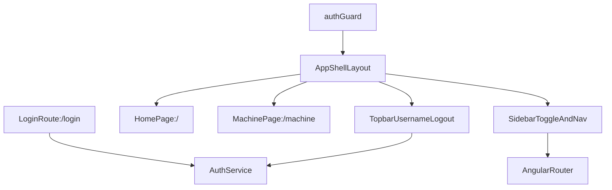

# Production-Grade Route Plan

## Target Outcome
สร้าง route และ layout สำหรับหน้า authenticated แบบ production grade โดยคงหน้า `[frontend/src/app/auth/login/login.component.ts](frontend/src/app/auth/login/login.component.ts)` ไว้นอก shell, เพิ่มหน้า Home ใหม่ที่ `/`, และย้ายหน้า Machine เดิมจาก root ไปเป็น `/machine` ภายใต้ shell เดียวกัน

## Current Baseline
โปรเจ็กต์ใช้ Angular standalone + functional guards และตอนนี้ route ยังเป็นแบบ flat อยู่ใน `[frontend/src/app/app.routes.ts](frontend/src/app/app.routes.ts)`:

```ts
export const routes: Routes = [
  { path: 'login', component: LoginComponent },
  { path: '', component: MachineComponent, canActivate: [authGuard] },
  { path: '**', redirectTo: '' },
];
```

ชื่อผู้ใช้และสถานะ auth มีอยู่แล้วใน `[frontend/src/app/auth/auth.service.ts](frontend/src/app/auth/auth.service.ts)` ผ่าน `currentUser`, `isLoggedIn`, และ `logout()` ดังนั้น topbar ใหม่ควรอ่านข้อมูลจาก service ตัวเดิมแทนการสร้าง state ซ้ำ

## Proposed Architecture


## Implementation Plan
1. Refactor routing in `[frontend/src/app/app.routes.ts](frontend/src/app/app.routes.ts)` to use a protected parent shell route with `children`, keeping `/login` public.
   - `/login` -> existing `LoginComponent`
   - `/` -> new Home page
   - `/machine` -> existing `MachineComponent`
   - wildcard should still redirect into the guarded app entry route

2. Create a shared authenticated shell component, likely under `[frontend/src/app/layout/](frontend/src/app/layout/)`, composed of:
   - topbar showing `currentUser()?.username` and logout action from `AuthService`
   - collapsible left sidebar with menu items for `Home` and `Machine`
   - responsive content region hosting a child `<router-outlet>`

3. Add a simple standalone Home page, e.g. `[frontend/src/app/home/home.component.ts](frontend/src/app/home/home.component.ts)`, as a lightweight welcome screen.
   - keep it intentionally simple
   - match current visual language from machine/login pages
   - ensure content remains readable in expanded and collapsed sidebar states

4. Remove page-shell concerns from `[frontend/src/app/machine/machine.component.html](frontend/src/app/machine/machine.component.html)` and keep `MachineComponent` focused on feature content.
   - move current username / role / logout navbar UI out of Machine
   - keep machine CRUD/search/modal behavior unchanged
   - preserve admin-only actions already driven by `isAdmin()`

5. Consolidate shared shell styling into global or shared styles instead of growing `[frontend/src/app/machine/machine.component.css](frontend/src/app/machine/machine.component.css)` further.
   - extract reusable tokens/patterns for nav, buttons, spacing, badges where sensible
   - avoid duplicating topbar/sidebar CSS across pages
   - keep modal z-index above shell overlays

6. Make the shell production-ready by covering expected UX details from the first pass.
   - active nav state for current route
   - accessible sidebar toggle button with labels/ARIA
   - sensible collapsed width and content spacing
   - responsive behavior for narrower screens
   - optional persistence of sidebar collapsed state as UI-only preference if implementation remains small and clean

7. Update focused tests impacted by the route/layout refactor.
   - route/app-shell expectations near `[frontend/src/app/app.spec.ts](frontend/src/app/app.spec.ts)` or related spec files
   - add only targeted tests that protect the new route structure and visible shell behavior

## Key Reuse Points
- `[frontend/src/app/auth/auth.service.ts](frontend/src/app/auth/auth.service.ts)`: source of `currentUser`, `isAdmin`, `logout()`
- `[frontend/src/app/auth/auth.guard.ts](frontend/src/app/auth/auth.guard.ts)`: reusable route protection for the shell
- `[frontend/src/app/machine/machine.component.ts](frontend/src/app/machine/machine.component.ts)`: existing feature logic should stay intact after layout extraction
- `[frontend/src/styles.css](frontend/src/styles.css)`: best place for truly global shell tokens/utilities if needed

## Acceptance Criteria
- unauthenticated users still land on `/login`
- authenticated users enter the app shell and see `Home` at `/`
- sidebar can toggle collapsed/expanded cleanly
- topbar shows current username from existing auth state
- Machine page is reachable from sidebar at `/machine`
- both Home and Machine render inside the same shell without duplicating topbar/sidebar
- existing machine CRUD behavior keeps working
