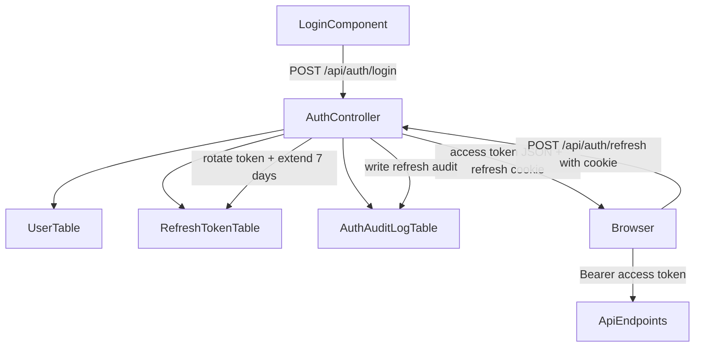

# Access + Refresh Token With Sliding Expiration

## Target Design

Replace the current single long-lived JWT flow with:

- Short-lived **access token** returned in JSON and kept in frontend memory only.
- Long-lived **refresh token** stored in **HttpOnly + Secure cookie**.
- **Sliding expiration**: every successful refresh rotates the refresh token and resets its expiry to 7 days from the refresh time.
- **Auth audit logging** for `login`, `refresh`, `logout`, and refresh/login failures.

## Current Code To Replace

The current app still uses a single JWT in `localStorage` and no refresh flow:

- `[frontend/src/app/auth/auth.service.ts](frontend/src/app/auth/auth.service.ts)`: stores `auth_token` and `auth_user` in `localStorage`
- `[frontend/src/app/auth/auth.interceptor.ts](frontend/src/app/auth/auth.interceptor.ts)`: adds one bearer token and logs out on `401`
- `[backend/Controllers/AuthController.cs](backend/Controllers/AuthController.cs)`: only `POST /api/auth/login`
- `[backend/Services/JwtTokenService.cs](backend/Services/JwtTokenService.cs)`: issues one JWT with fixed expiry
- `[backend/Data/AppDbContext.cs](backend/Data/AppDbContext.cs)`: only `Users` and `Machines`

## Backend Changes

### 1. Token model split

Update `[backend/Models/AuthModels.cs](backend/Models/AuthModels.cs)` so responses are explicit:

- `LoginResponse`: `accessToken`, `expiresIn`, `user`
- `RefreshResponse`: `accessToken`, `expiresIn`, `user`
- optional `LogoutResponse` or empty `204`

Keep the frontend user payload minimal: `username`, `role`.

### 2. New refresh token persistence

Add `[backend/Models/RefreshToken.cs](backend/Models/RefreshToken.cs)` and register it in `[backend/Data/AppDbContext.cs](backend/Data/AppDbContext.cs)`.

Recommended columns:

- `Id`: PK
- `UserId`: FK to `users.id`
- `TokenHash`: hashed refresh token, never store raw token
- `ExpiresAtUtc`: current expiry timestamp
- `CreatedAtUtc`: issued time
- `LastUsedAtUtc`: last successful refresh time
- `RevokedAtUtc`: revoke timestamp
- `RevokedReason`: manual logout, rotation reuse, expiry cleanup, etc.
- `ReplacedByTokenId`: self-reference for rotation chain
- `CreatedByIp`: request IP at creation
- `CreatedByUserAgent`: request user-agent at creation
- `LastUsedByIp`: request IP on latest refresh
- `LastUsedByUserAgent`: request user-agent on latest refresh

Indexes:

- `UserId`
- `ExpiresAtUtc`
- `RevokedAtUtc`

### 3. New auth audit log persistence

Add `[backend/Models/AuthAuditLog.cs](backend/Models/AuthAuditLog.cs)` and register it in `[backend/Data/AppDbContext.cs](backend/Data/AppDbContext.cs)`.

Recommended columns:

- `Id`: PK
- `UserId`: nullable FK when user is known
- `Username`: raw username submitted or resolved username
- `EventType`: `LoginSuccess`, `LoginFailure`, `RefreshSuccess`, `RefreshFailure`, `LogoutSuccess`, `LogoutFailure`
- `Succeeded`: boolean
- `FailureReason`: invalid password, invalid refresh token, revoked token, expired token, etc.
- `IpAddress`: caller IP
- `UserAgent`: caller user-agent
- `CorrelationId`: request trace/correlation value for investigation
- `OccurredAtUtc`: event timestamp
- `RefreshTokenId`: nullable FK when event relates to a refresh token record
- `MetadataJson`: optional compact extra context for anomaly analysis

Indexes:

- `OccurredAtUtc`
- `UserId`
- `EventType`
- `(Succeeded, OccurredAtUtc)` if useful for incident review

### 4. Refresh token service

Add a dedicated service, e.g. `[backend/Services/RefreshTokenService.cs](backend/Services/RefreshTokenService.cs)`, responsible for:

- generating cryptographically random refresh tokens
- hashing before storage
- validating incoming cookie token
- rejecting expired/revoked/reused tokens
- rotating refresh tokens on every successful refresh
- applying **sliding expiration** by setting `ExpiresAtUtc = UtcNow + 7 days` for the new token every refresh
- revoking the active token on logout
- optionally detecting token reuse and revoking the token family

### 5. JWT service changes

Update `[backend/Services/JwtTokenService.cs](backend/Services/JwtTokenService.cs)`:

- rename current method to clearly generate **access tokens** only
- use short expiry from config, e.g. `Jwt:AccessTokenExpiryMinutes`
- include `UserId`, `Username`, `Role`, `jti`
- keep issuer/audience validation as-is

### 6. Auth controller endpoints

Expand `[backend/Controllers/AuthController.cs](backend/Controllers/AuthController.cs)`:

- `POST /api/auth/login`
  - validate credentials
  - issue access token
  - create refresh token row
  - set refresh cookie
  - write `LoginSuccess` or `LoginFailure` audit log
- `POST /api/auth/refresh`
  - read refresh cookie
  - validate against DB
  - rotate token
  - extend expiry to **7 days from now**
  - issue new access token
  - overwrite refresh cookie
  - write `RefreshSuccess` or `RefreshFailure`
- `POST /api/auth/logout`
  - revoke current refresh token if present
  - clear cookie
  - write `LogoutSuccess` or `LogoutFailure`

### 7. Cookie and config changes

Update `[backend/Program.cs](backend/Program.cs)` and `[backend/appsettings.json](backend/appsettings.json)` / `[backend/appsettings.Development.json](backend/appsettings.Development.json)`:

- add config keys such as:
  - `Jwt:AccessTokenExpiryMinutes`
  - `Jwt:RefreshTokenSlidingDays` = `7`
  - `Jwt:RefreshCookieName`
  - `Jwt:RefreshCookiePath`
- ensure CORS still supports credentials for the frontend origin
- keep `UseAuthentication()` / `UseAuthorization()` order intact

### 8. EF migration

Add a new migration to create:

- `refresh_tokens`
- `auth_audit_logs`

Do not alter existing `users` / `machine` semantics unless needed for optional fields.

## Frontend Changes

### 9. Auth service refactor

Update `[frontend/src/app/auth/auth.service.ts](frontend/src/app/auth/auth.service.ts)`:

- stop persisting access token in `localStorage`
- keep access token in a private signal or private field in memory
- call login with `withCredentials: true`
- add `refreshSession()` that calls `/api/auth/refresh` with credentials
- add `initializeSession()` to silently restore session on app start using refresh cookie
- keep user role/username in memory; optional lightweight persistence only if it does not become an auth source of truth

### 10. Interceptor retry flow

Update `[frontend/src/app/auth/auth.interceptor.ts](frontend/src/app/auth/auth.interceptor.ts)`:

- attach bearer access token from memory only
- exclude `/api/auth/login`, `/api/auth/refresh`, `/api/auth/logout`
- on `401`, attempt one shared refresh request
- retry the original request after successful refresh  
- logout only if refresh fails
- deduplicate concurrent `401` refreshes so only one refresh request is sent at a time

### 11. App bootstrap / guard behavior

Update `[frontend/src/app/auth/auth.guard.ts](frontend/src/app/auth/auth.guard.ts)` and likely `[frontend/src/app/app.config.ts](frontend/src/app/app.config.ts)`:

- support async auth bootstrap before protected routes resolve
- call `initializeSession()` early so page reload does not immediately force logout

### 12. Login component contract

Update `[frontend/src/app/auth/login/login.component.ts](frontend/src/app/auth/login/login.component.ts)` and `[frontend/src/app/auth/auth.model.ts](frontend/src/app/auth/auth.model.ts)`:

- expect `accessToken` + `user` payload instead of the current single `token`
- no direct token persistence in browser storage

The machine screens in `[frontend/src/app/machine/machine.component.ts](frontend/src/app/machine/machine.component.ts)` and `[frontend/src/app/machine/machine.component.html](frontend/src/app/machine/machine.component.html)` should remain mostly unchanged because they already consume `currentUser` and `isAdmin`.

## DB Tables To Add

### `refresh_tokens`

Purpose: stores server-side state for refresh token validation, rotation, sliding expiry, and revocation.

Columns:

- `id`: unique row ID
- `user_id`: owner user
- `token_hash`: hashed token value
- `expires_at_utc`: active expiry; reset to now + 7 days on successful refresh
- `created_at_utc`: issuance timestamp
- `last_used_at_utc`: latest refresh usage timestamp
- `revoked_at_utc`: revoke time
- `revoked_reason`: why the token was invalidated
- `replaced_by_token_id`: link to rotated replacement token
- `created_by_ip`: IP at login issuance
- `created_by_user_agent`: device/browser at login issuance
- `last_used_by_ip`: IP at last refresh
- `last_used_by_user_agent`: device/browser at last refresh

### `auth_audit_logs`

Purpose: immutable trail for auth-related activity and anomaly investigation.

Columns:

- `id`: unique row ID
- `user_id`: nullable related user
- `username`: submitted or resolved username
- `event_type`: auth event category
- `succeeded`: success/failure flag
- `failure_reason`: failure detail when applicable
- `ip_address`: caller IP
- `user_agent`: browser/client identity
- `correlation_id`: trace ID to correlate app logs and requests
- `occurred_at_utc`: event time
- `refresh_token_id`: nullable related refresh token row
- `metadata_json`: optional extra structured context

## Implementation Order

1. Add new auth entities and EF mappings in `[backend/Data/AppDbContext.cs](backend/Data/AppDbContext.cs)`.
2. Add migration for `refresh_tokens` and `auth_audit_logs`.
3. Implement refresh token service and audit logging service.
4. Update JWT service and auth DTOs.
5. Extend `[backend/Controllers/AuthController.cs](backend/Controllers/AuthController.cs)` with `login`, `refresh`, `logout` using cookie-based refresh.
6. Refactor frontend auth service and interceptor to memory + refresh flow.
7. Add async session initialization in frontend bootstrap/guard.
8. Verify login, refresh rotation, sliding 7-day extension, logout, and audit log writes.

## Verification Checklist

- Login returns access token and sets refresh cookie.
- Refresh rotates the token and the new DB row expiry becomes exactly `UtcNow + 7 days`.
- Reusing a revoked or replaced refresh token fails and creates `RefreshFailure` audit.
- Logout revokes current refresh token, clears cookie, and logs `LogoutSuccess`.
- Reloading the SPA restores session via refresh cookie.
- Admin/User role checks on machine pages still behave exactly as before.

