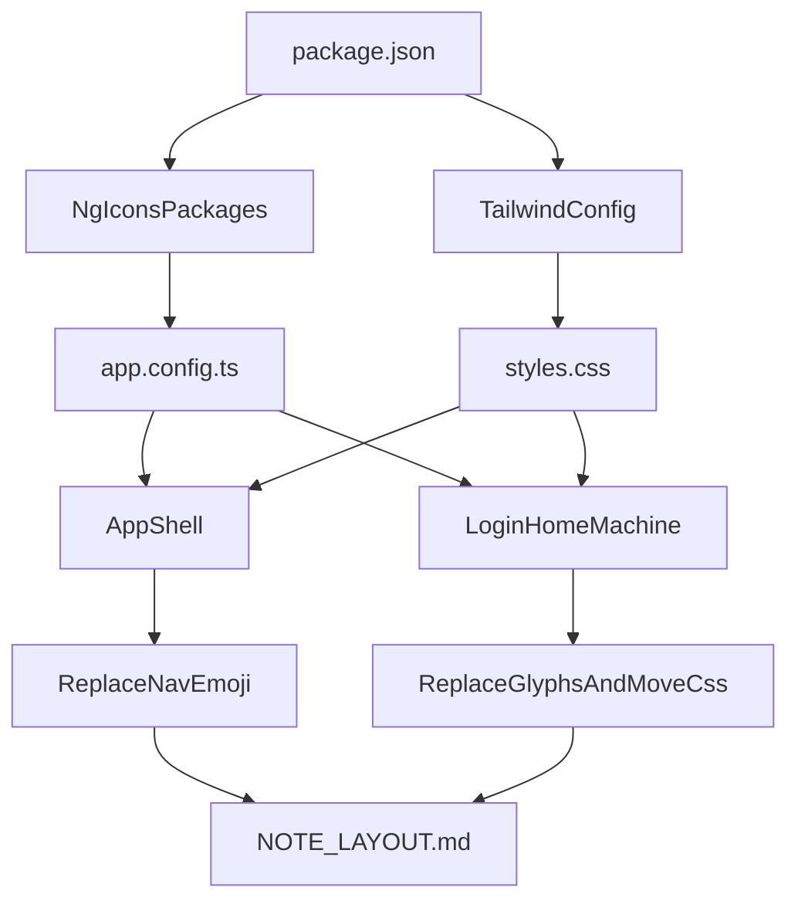

# Tailwind + Icon Migration Plan

## Goal
ปรับ frontend Angular 22 ใน `frontend/` ให้ใช้ Tailwind เข้ากับ codebase เดิมแบบค่อยเป็นค่อยไป และแทนที่ emoji / Unicode glyph ที่ใช้เป็น icon ด้วย `@ng-icons/core` + selected icons จาก `heroicons`, `lucide`, และ `huge-icons` โดยไม่รัน `npm install` ในขั้นตอนนี้ แต่เตรียม dependency/config ให้ไปติดตั้งใน Docker flow แทน

## Current Baseline
- โปรเจกต์ยังใช้ CSS ปกติทั้งหมด และ global utility หลักอยู่ใน [C:/Data/Drive D/app/Basic App/frontend/src/styles.css](C:/Data/Drive D/app/Basic%20App/frontend/src/styles.css) เช่น `.btn`, `.btn-primary`, `.btn-secondary`, `.btn-sm`
- Angular app bootstrap อยู่ที่ [C:/Data/Drive D/app/Basic App/frontend/src/app/app.config.ts](C:/Data/Drive D/app/Basic%20App/frontend/src/app/app.config.ts) และยังไม่มี icon provider กลาง
- Build ใช้ Angular 22 application builder ตาม [C:/Data/Drive D/app/Basic App/frontend/angular.json](C:/Data/Drive D/app/Basic%20App/frontend/angular.json) และตอนนี้ยังไม่มี Tailwind/PostCSS config
- รูปแบบ nav และ icon ปัจจุบันถูกอธิบายไว้ใน [C:/Data/Drive D/app/Basic App/NOTE_LAYOUT.md](C:/Data/Drive D/app/Basic%20App/NOTE_LAYOUT.md) โดย `navItems` ยังเก็บ `icon` เป็น emoji string

## Implementation Strategy

### 1. Wire Tailwind without breaking existing CSS
- เพิ่ม dependencies ที่ `frontend/package.json` สำหรับ Tailwind/PostCSS เท่านั้น โดยไม่รัน install ใน local
- เพิ่ม Tailwind entry/config สำหรับ Angular 22 build pipeline ใน `frontend/` ให้ `src/styles.css` เป็นจุดรวมเดิมต่อไป
- คง CSS เดิมไว้ก่อน แล้วใช้ Tailwind เป็น additive layer เพื่อไม่ให้ shell/login/machine พังในรอบแรก
- วาง theme token หรือ base utility ให้ map กับ palette เดิม (`slate`/`blue` family) แทนการปล่อย hex กระจายเพิ่ม

### 2. Define migration rules for CSS -> Tailwind
- คง component CSS ที่มี logic layout ซับซ้อน เช่น shell sidebar widths / topbar sizing ไว้ก่อน
- ย้าย utility ที่ซ้ำกันหลายจุดไปเป็น Tailwind-first pattern เช่น buttons, form controls, alert, spacing, flex alignment
- เริ่มจากหน้าที่เล็กก่อน แล้วค่อยไปหน้าที่ CSS หนาแน่นที่สุด (`machine`) เพื่อให้ refactor เป็นช่วง ๆ และรีวิวได้ง่าย
- ปรับ guideline ใน `NOTE_LAYOUT.md` ให้ future changes ใช้ Tailwind classes และไม่สร้าง CSS ซ้ำแบบเดิม

### 3. Introduce a centralized icon system
- เพิ่ม `@ng-icons/core`, `@ng-icons/heroicons`, `@ng-icons/lucide`, `@ng-icons/huge-icons` ใน `frontend/package.json` โดยไม่ install เอง
- ลงทะเบียน icon ที่ใช้จริงแบบรายตัวใน `app.config.ts` ผ่าน `provideIcons(...)` เพื่อคุม bundle size
- ถ้ามีการใช้หลาย pack พร้อมกัน ให้มี shared icon map เช่น `shared/app-icons.ts` เพื่ออ้างชื่อ icon แบบ semantic แทนการกระจายชื่อ pack ไปทั่ว template

### 4. Replace emoji/glyph usage by priority
- เปลี่ยน navigation shell ก่อน: `navItems.icon` จาก emoji string ไปเป็น icon key/name และ render ผ่าน `<ng-icon>` ใน shell template
- เปลี่ยน glyph ที่ซ้ำหลายที่ก่อน เช่น `✕`, `✓`, `+`, menu toggle เพื่อสร้างรูปแบบกลางที่ reuse ได้
- เปลี่ยนปุ่ม action ใน machine page (`edit`, `delete`, `close`, `clear`) จาก text+emoji เป็น icon + label ที่จัด alignment ด้วย Tailwind
- ปรับ login alert icon และจุดอื่น ๆ ให้ใช้ icon system เดียวกัน

### 5. Migrate templates toward Tailwind incrementally
- หน้า `home` ใช้เป็น pilot สำหรับ utility classes เพราะเล็กและเสี่ยงต่ำ
- หน้า `login` ย้าย form/card/alert/button classes ไป Tailwind มากขึ้น และลด CSS ซ้ำกับ machine
- หน้า `machine` ค่อย refactor เป็นชุด: header/actions, filters/search, table, alerts, modal
- หลังย้ายแต่ละหน้าค่อยลบ CSS ที่ไม่จำเป็นออก เพื่อลด duplication แทนการ rewrite ทั้งหมดทีเดียว

### 6. Update documentation and guardrails
- อัปเดต `NOTE_LAYOUT.md` ให้ nav item ใช้ icon name ไม่ใช่ emoji
- ระบุ convention ใหม่ว่า shared UI primitives ควรใช้ Tailwind utilities หรือ shared Tailwind-based patterns ก่อนสร้าง CSS ใหม่
- ระบุด้วยว่าการเพิ่ม dependency ใหม่จะถูกปล่อยให้ Docker/build process เป็นคน install

## File Focus
- [C:/Data/Drive D/app/Basic App/frontend/package.json](C:/Data/Drive D/app/Basic%20App/frontend/package.json): เพิ่ม dependency สำหรับ Tailwind และ `@ng-icons`
- [C:/Data/Drive D/app/Basic App/frontend/angular.json](C:/Data/Drive D/app/Basic%20App/frontend/angular.json): ตรวจจุดเชื่อม global styles/build config
- [C:/Data/Drive D/app/Basic App/frontend/src/styles.css](C:/Data/Drive D/app/Basic%20App/frontend/src/styles.css): เพิ่ม Tailwind entry และ shared utility/theme layer
- [C:/Data/Drive D/app/Basic App/frontend/src/app/app.config.ts](C:/Data/Drive D/app/Basic%20App/frontend/src/app/app.config.ts): ลงทะเบียน icons
- [C:/Data/Drive D/app/Basic App/frontend/src/app/layout/app-shell.component.ts](C:/Data/Drive D/app/Basic%20App/frontend/src/app/layout/app-shell.component.ts) and [C:/Data/Drive D/app/Basic App/frontend/src/app/layout/app-shell.component.html](C:/Data/Drive D/app/Basic%20App/frontend/src/app/layout/app-shell.component.html): จุดเริ่มของ nav/icon migration
- [C:/Data/Drive D/app/Basic App/frontend/src/app/auth/login/login.component.html](C:/Data/Drive D/app/Basic%20App/frontend/src/app/auth/login/login.component.html) and [C:/Data/Drive D/app/Basic App/frontend/src/app/machine/machine.component.html](C:/Data/Drive D/app/Basic%20App/frontend/src/app/machine/machine.component.html): จุดหลักของการแทน emoji/glyph และย้าย CSS ไป Tailwind
- [C:/Data/Drive D/app/Basic App/NOTE_LAYOUT.md](C:/Data/Drive D/app/Basic%20App/NOTE_LAYOUT.md): อัปเดต conventions

## Suggested Rollout Order
1. Add package/config scaffolding for Tailwind and `@ng-icons`
2. Establish shared Tailwind/icon conventions in global layer + app config
3. Migrate shell navigation icons
4. Migrate `home` as Tailwind pilot
5. Migrate `login` shared form/alert patterns
6. Migrate `machine` page in sections and remove obsolete CSS
7. Update docs and verify no emoji/glyph-based UI remains

## Key Risks
- `machine` component มี CSS หนาแน่นและมี duplicated utility หลายชุด จึงควรแยก refactor เป็นช่วง ไม่ควร rewrite ทั้งหน้าในครั้งเดียว
- shell layout ใช้ CSS variables สำหรับ sidebar/topbar อยู่แล้ว ควรเก็บไว้ก่อนและใช้ Tailwind เฉพาะ utility/layout ที่ไม่กระทบ behavior
- ต้องระวังเรื่อง icon sizing/alignment เพราะปัจจุบันหลายจุดอิง `font-size` ของ emoji/glyph ไม่ใช่ SVG icon sizing

## Architecture Sketch


## Essential References
Current shared button baseline in `styles.css`:

```css
.btn {
    display: inline-flex;
    align-items: center;
    gap: 0.375rem;
}
```

Current bootstrap extension point in `app.config.ts`:

```ts
export const appConfig: ApplicationConfig = {
  providers: [
    provideBrowserGlobalErrorListeners(),
    provideRouter(routes),
    provideHttpClient(withInterceptors([authInterceptor])),
  ],
};
```

Current nav convention in `NOTE_LAYOUT.md`:

```ts
navItems = [
  { route: '/', label: 'Home', icon: '🏠' },
  { route: 'machine', label: 'Machine', icon: '⚙️' },
];
```
